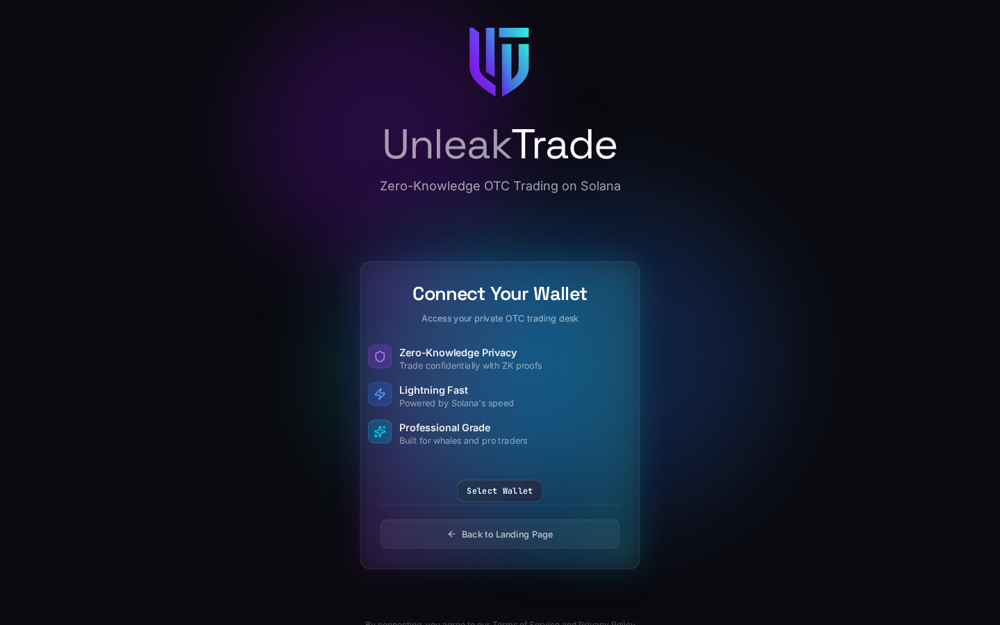
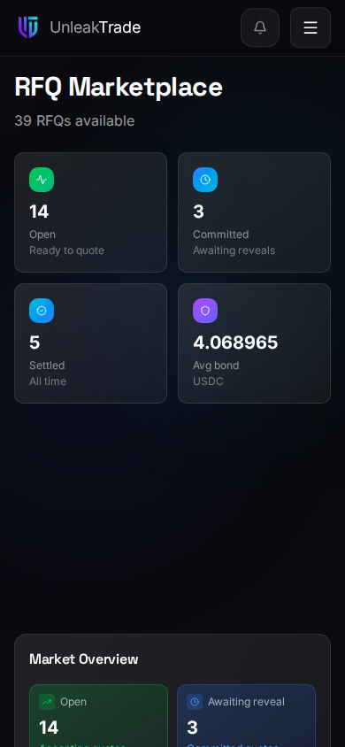

# Getting Started


The UnleakTrade app lives at [**app.unleak.trade**](https://app.unleak.trade). This guide walks you through it screen by screen.


You do not need to install anything: the app runs in your browser and talks to Solana through the wallet you already use.

***

## Connect Your Wallet

The first screen you see is the connect gate. UnleakTrade supports every modern Solana wallet — Phantom, Solflare, Backpack, Glow, and any other wallet that follows the Wallet Standard is discovered automatically.

<figure><figcaption>The connect gate — pick any Wallet Standard wallet.</figcaption></figure>

Press **Select Wallet**, choose your wallet from the list, and approve the connection in the wallet popup.

***

## Sign In With a Signature

Right after connecting, your wallet asks you to **sign a short message**. This is UnleakTrade's sign-in:

* it proves the wallet is really yours and unlocked,
* it is a plain message signature — **not a transaction**, so it costs nothing and moves nothing,
* it lasts for the browser tab: refreshing keeps you signed in, closing the tab signs you out.


If you close the wallet popup by accident, use the **Cancel** button on the signing screen and connect again — nothing is lost.


***

## Find Your Way Around

Once signed in you land on the dashboard. The navigation bar gives you everything:

* **Marketplace** — every RFQ on the network, grouped by state.
* **My Activity** — the RFQs you posted, the quotes you made, and your rewards, in one place.
* **Transparency** — the protocol's public ledger of fees and slashed bonds.
* **Create RFQ** — the four-step wizard for posting your own request.
* **The control rail** — the guard-status pill (the liquidity guard's live health), notifications, and the network switcher.

***

## Pick Your Network

The network switcher in the navigation bar selects the Solana cluster — **Devnet** for trying things out with test tokens, **Mainnet** for real trading. Your choice is remembered on this device.


Everything on Devnet is play money. It is the perfect place to walk through this guide end to end before committing real funds.


***

## Works on Any Screen

The app is fully responsive — every flow in this guide works the same on a phone, with bottom sheets replacing popovers.

<figure><figcaption>The marketplace on a phone.</figcaption></figure>

***

👉 Continue to [**Browsing the Marketplace**](browsing-the-marketplace.md).
