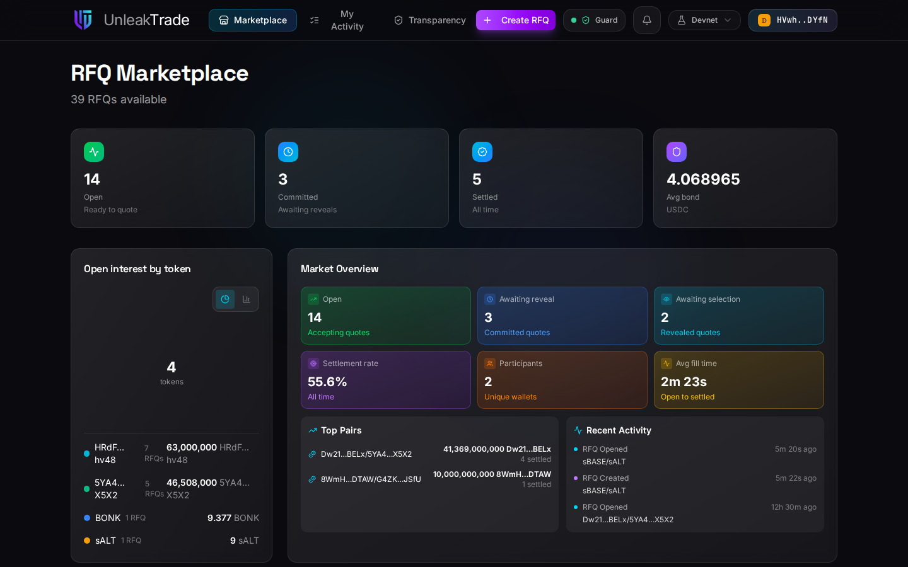
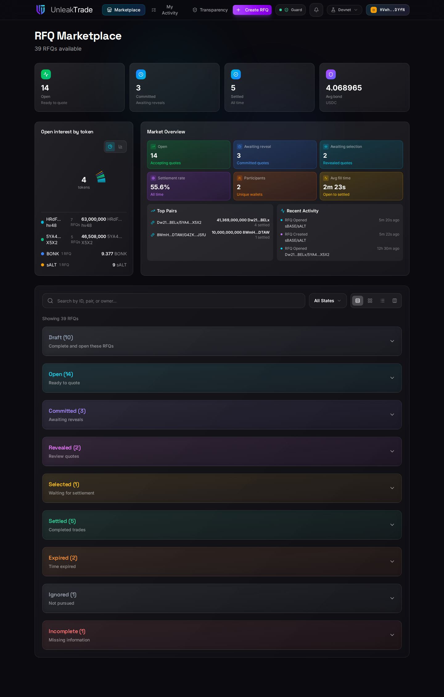
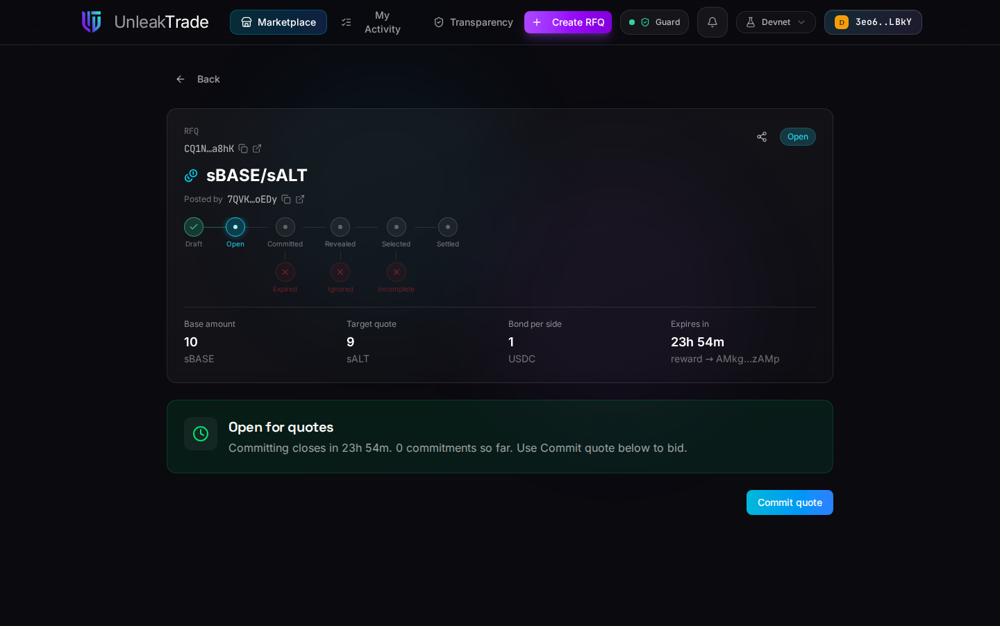
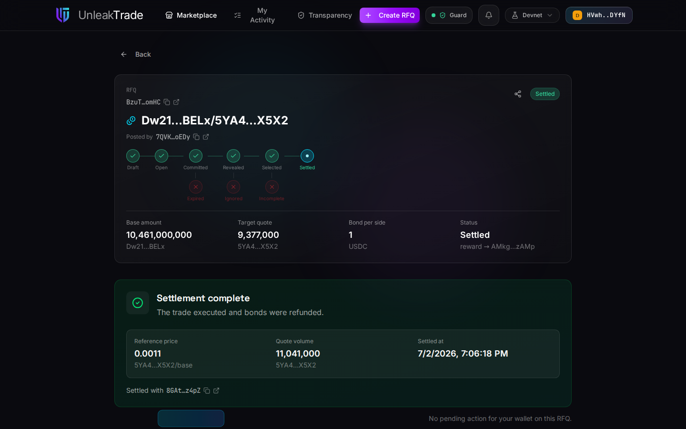

# Browsing the Marketplace


The Marketplace is the default view: every RFQ on the network, live market statistics, and a grouped list you can drill into.


***

## The Market at a Glance

The top of the page summarizes the current market: how many RFQs are open for quoting, how many are waiting on reveals, how many have settled, and the average bond size. Below it, **Open interest by token** and the **Market Overview** panel break the same data down further — settlement rate, participants, average fill time, top pairs, and a recent-activity feed.

<figure><figcaption>Live market statistics, derived entirely from on-chain accounts.</figcaption></figure>


Every statistic on this screen — the counts, settlement rate, average fill time, average bond — is computed in your browser from the on-chain RFQ accounts; there is no analytics backend. Token names and logos come from a token catalog (Jupiter's token list on Mainnet Beta, a bundled list on other networks). Amounts are never summed into a dollar figure — the protocol uses no price oracle — though on Mainnet Beta the app may show an indicative USD hint next to a single amount you type.


***

## The RFQ List

Below the statistics, RFQs are grouped by lifecycle state — the same nine states described in [**RFQ States**](../rfq_states.md). Each group shows its count and a one-line hint of what the state means; expand a group to see its RFQs as cards, and use the search box or the state filter to narrow the list.

<figure><figcaption>The grouped list — Draft through Settled, plus the three failure states.</figcaption></figure>

***

## The RFQ Detail Page

Press **View** on any card to open the RFQ's detail page.

<figure><figcaption>An Open RFQ: state pipeline, key figures, deadline, and the action bar.</figcaption></figure>

Reading it top to bottom:

* **The state pipeline** shows where the RFQ is in its lifecycle — completed states are checked, the current one is highlighted, and the red branches underneath are the failure exits.
* **The key figures** — base amount, target quote, bond per side, and the live countdown to the next deadline.
* **The status banner** explains in one sentence what is happening right now and what happens next.
* **The action bar** at the bottom shows buttons only for actions that are *legal for your wallet in this state*. If you posted the RFQ you will see different actions than someone browsing it — the app derives this automatically; there is nothing to configure. The app never asks you to pick a role: what these docs call the maker, taker, or facilitator view is simply whatever is legal for your connected wallet right now.


The share icon produces a deep link (with a QR code) straight to this RFQ — handy for sending it to a taker you already have in mind.


***

## A Finished Trade

Once an RFQ settles, its detail page becomes a permanent receipt: the full pipeline is checked off and the settlement panel records the reference price, quote volume, and timestamp.

<figure><figcaption>A settled RFQ — the trade executed and both bonds were refunded.</figcaption></figure>

***

👉 Ready to post your own? Continue to [**Creating an RFQ**](creating-an-rfq.md).
