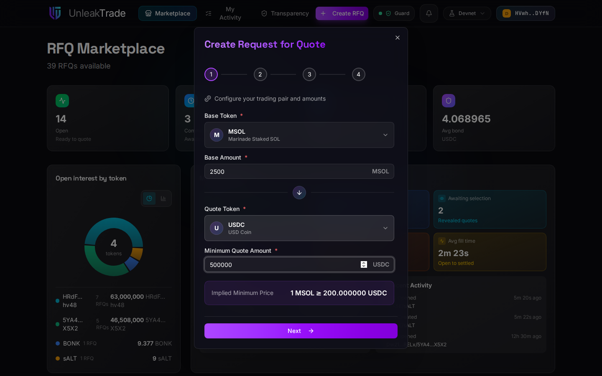
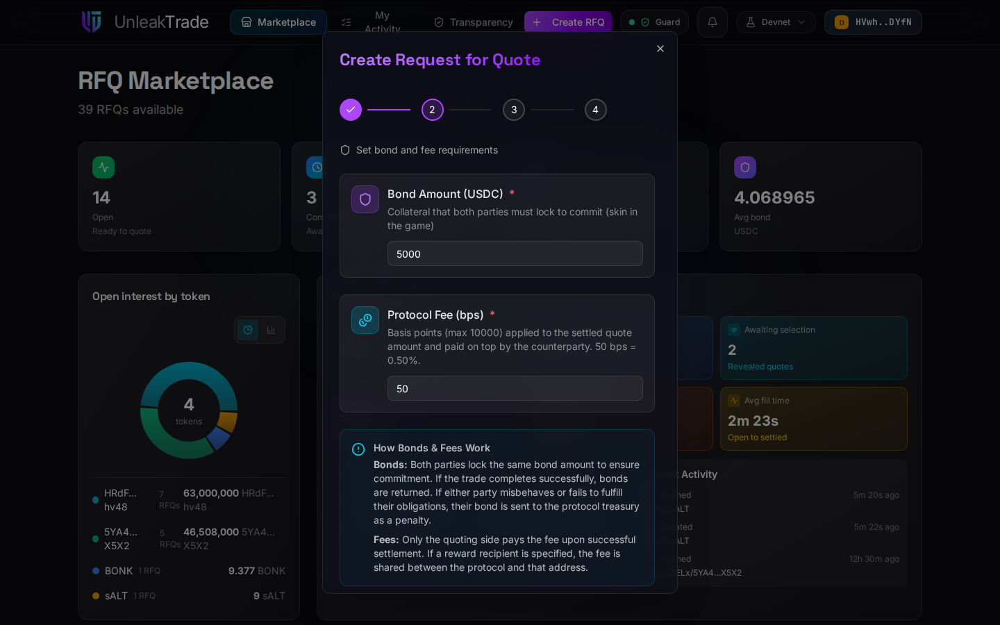
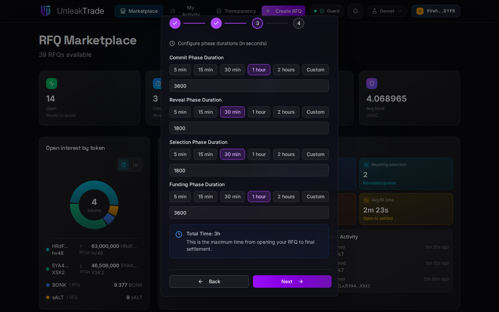
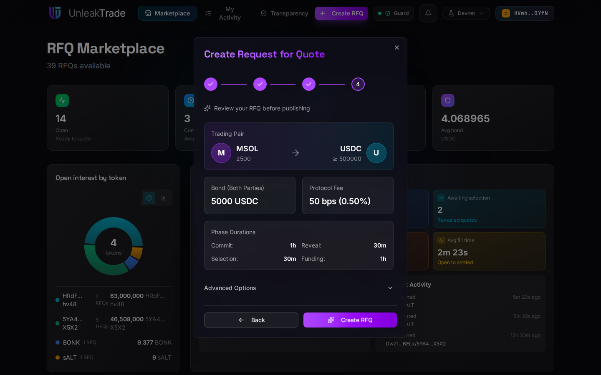

# Creating an RFQ


**Create RFQ** in the navigation bar opens a four-step wizard: pair → economics → timing → review. Nothing touches the chain until you submit the final step.


***

## Step 1 — Pair and Amounts

Pick the token you are offering (**base**) and the token you want quotes in (**quote**), then enter the base amount you will deliver and the minimum quote you are willing to accept. The wizard shows the implied minimum price as you type.

<figure><figcaption>Step 1 — the pair, your amount, and your minimum.</figcaption></figure>

Well-known tokens are in the **Listed** catalog; any other SPL token can be entered on the **Unlisted** tab with its mint address, symbol, and decimals.

***

## Step 2 — Bond and Fee

Two numbers define the economics of your RFQ:

* **Bond amount (USDC)** — the collateral *both sides* lock: you post it when you publish, and every taker posts the same amount when they commit a quote. Size it high enough to keep everyone serious, low enough not to scare participants away.
* **Protocol fee (bps)** — the fee charged on the settled quote amount, **paid on top by the selected taker** (you receive your full quote amount). 50 bps = 0.50%.

<figure><figcaption>Step 2 — the bond both sides will lock, and the protocol fee in bps.</figcaption></figure>


For exactly what these numbers cost each participant — and what comes back — see [**The Cost of UnleakTrade**](../rfq/cost-of-unleaktrade.md).


***

## Step 3 — Phase Durations

Set the four time windows of the lifecycle: how long takers can **commit**, how long they have to **reveal**, how long you have to **select**, and how long the winner has to **fund**. The presets cover common cases; **Custom** accepts any duration in seconds. The wizard totals them so you can see the maximum time from publishing to final settlement.

<figure><figcaption>Step 3 — commit, reveal, selection, and funding windows.</figcaption></figure>


Deadlines are enforced on-chain. Short windows keep things moving but leave less room for takers in other time zones — see [**Lifecycle**](../rfq/lifecycle/README.md) for how the phases chain together.


***

## Step 4 — Review and Create

The last step shows everything in one card. Under **Advanced Options** you can name a reward recipient — the facilitator address that will earn a share of the fee if the winning quote names the same address (see [**Facilitator Perspective**](../rfq/facilitator-perspective.md)).

<figure><figcaption>Step 4 — review, then create the draft.</figcaption></figure>

Pressing **Create RFQ** submits one transaction and creates your RFQ **as a draft**. Like everything on-chain, a draft is publicly visible — it appears in the marketplace's Draft group — but it is not open for quotes yet, and no bond has been posted.

***

## From Draft to Open

On the draft's detail page (or straight from **My Activity**), you can still:

* **Edit parameters** — change anything with the same wizard,
* **Cancel** the draft — this closes it and refunds the account deposit,
* **Open** it — this is the moment your **bond is locked** and the commit window starts counting.


Once open, share the RFQ with the share button's deep link or QR code to bring takers straight to it.


***

👉 On the other side of the trade? Continue to [**Submitting a Quote**](submitting-a-quote.md).
