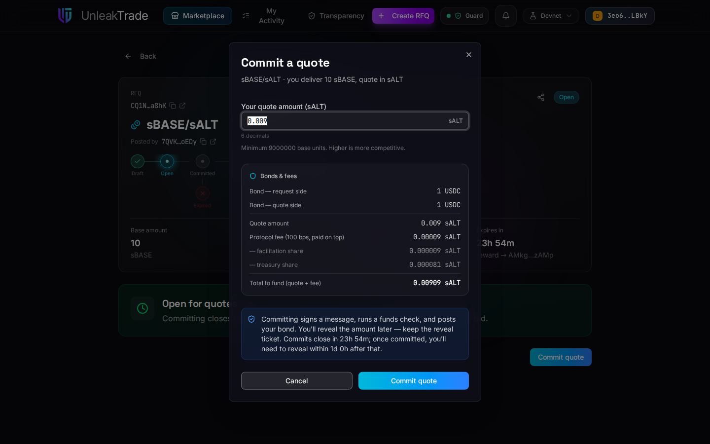

# Submitting a Quote


Quoting is a three-act flow — **commit** a hidden quote while the RFQ is open, **reveal** it after commits close, and **settle** if you are selected. The app walks you through each act at the right time.


***

## Committing a Quote

Open any RFQ in the **Open** group and press **Commit quote**.

<figure><figcaption>The commit modal — your amount stays secret; the breakdown shows exactly what settling would cost.</figcaption></figure>

Enter your quote amount — it is pre-filled with the RFQ's minimum, and higher is more competitive. The **Bonds & fees** panel shows the full economics before you sign anything: the bond each side posts, the protocol fee (paid on top of your quote), any facilitation share, and the **total you would need to fund** if you win.

When you press **Commit quote**, the app:

1. asks your wallet to **sign a message** (this derives your secret salt — free, not a transaction),
2. runs an automatic **liquidity check** with the attestation service, which verifies your balances cover the bond and the potential settlement,
3. sends one transaction that locks your **bond** and records only the *hash* of your quote on-chain.


**Keep the reveal ticket.** After committing, the app stores a local backup and offers a downloadable ticket file. The ticket (or the same wallet re-signing) is what lets you reveal later — without it, a commitment can never be revealed and the bond is forfeited when the reveal window closes.


Nobody — not the maker, not the other takers — can see your amount until you reveal it.

***

## Revealing

Once the commit window closes, the reveal window opens and the **Reveal quote** action appears on the RFQ (and in **My Activity**, under *Needs your attention*). It leads to a dedicated reveal screen that:

* re-derives your commitment locally and shows a live match against what is recorded on-chain,
* lets you **import your ticket** or re-derive the salt with a wallet signature if this is a new device,
* submits the reveal — a plain transaction with no token movement.


Revealing on time is what protects your bond: revealed-but-unselected quotes are always refundable.


***

## Settling — If You Win

If the maker selects your quote, the funding window starts and the **Settle now** action appears. The settle screen shows the exact funding requirement — **your quote amount plus the protocol fee** — checks it against your balance, and submits the settlement transaction. In that single transaction the quote amount goes to the maker, the base tokens come to you, the fee is paid, and **both bonds are refunded**. A receipt card confirms the result, exportable as an image.


The line-by-line costs of committing and settling — accounts created, deposits, and the fee formula with a worked example — are in [**The Cost of UnleakTrade**](../rfq/cost-of-unleaktrade.md).


***

## Not Selected? Reclaim Your Bond

If you revealed but another quote won (or no quote was selected), a **Reclaim bond** action appears once the funding window has passed. One click returns your full bond. The same applies on the failure paths — honest reveals are never penalized (see [**Failure & Exit Paths**](../rfq/lifecycle/failure-and-exit-paths.md)).

***

👉 Continue to [**Tracking Activity & Rewards**](tracking-activity-and-rewards.md).
