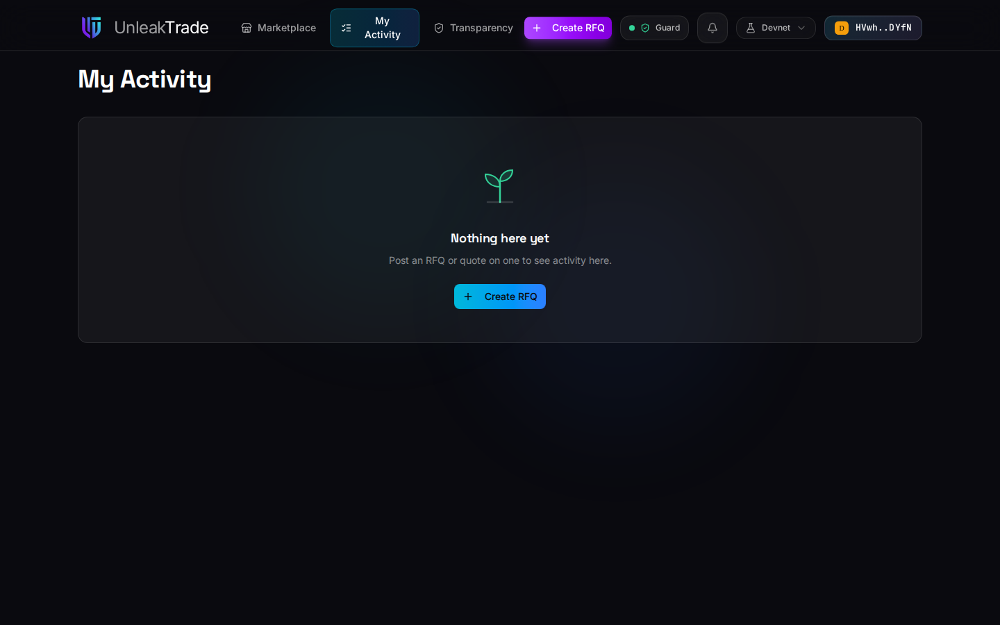
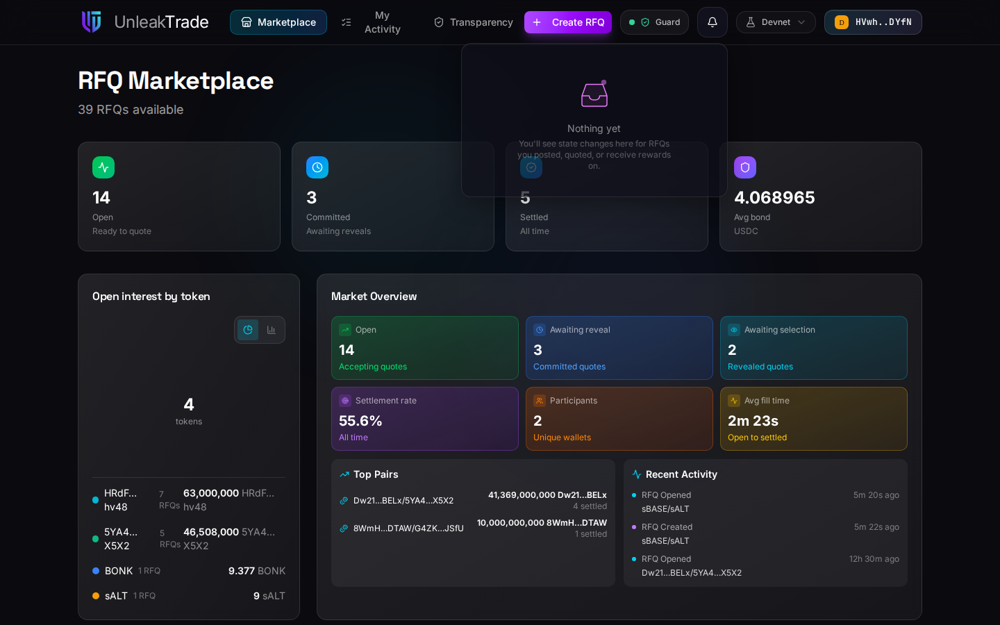

# Tracking Activity & Rewards


**My Activity** is your single home base: the requests you posted, the quotes you committed, and the rewards you can claim — with anything that needs action surfaced at the top.


***

## My Activity

<figure><figcaption>My Activity before your first trade — post an RFQ or quote on one and it fills up.</figcaption></figure>

Once you are active, the screen organizes itself around what matters:

* **The summary bar** pins your headline numbers — including a **Claim** button the moment any reward is claimable.
* **Needs your attention** is a ribbon of direct-action chips: a reveal window closing, a settlement to fund, a bond to reclaim, a quote to select. Each chip jumps straight to the action.
* **Three sections** — *RFQs I posted*, *Quotes I submitted*, and *Rewards history* — hold everything else as horizontally scrolling cards. A section expands automatically whenever it contains something pending.


You never need to remember deadlines yourself: anything time-sensitive appears in the attention ribbon while there is still time to act.


***

## Claiming Rewards

If you act as a facilitator — the address named on both an RFQ and its winning quote — your earned shares appear under **Rewards history** as *pending* after each settlement. The **Claim** button withdraws them, one quick transaction per reward, and moves them to *claimed*.

Rewards are always denominated in the quote token of the trade they came from — the app never converts them into a single currency. See [**Facilitator Perspective**](../rfq/facilitator-perspective.md) for how eligibility works and [**The Cost of UnleakTrade**](../rfq/cost-of-unleaktrade.md) for the claim's cost.

***

## Notifications

The bell in the navigation bar collects state changes on everything you touch: commits on your RFQs, selections, settlements, rewards. The inbox is per-wallet and lives in your browser — no emails, no servers watching you.

<figure><figcaption>The notification inbox — state changes for RFQs you posted, quoted, or earn rewards on.</figcaption></figure>

***

👉 Continue to [**Transparency**](transparency.md).
