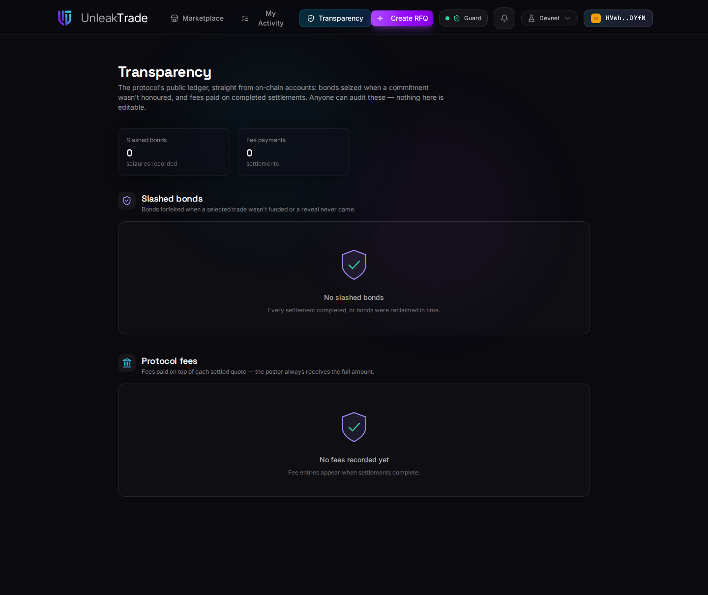

# Transparency


The **Transparency** view is the protocol's public ledger, rendered straight from on-chain accounts. Anyone can audit it; nobody can edit it.


***

## What It Shows

<figure><figcaption>The two ledgers — bond seizures and fee payments — with nothing to hide.</figcaption></figure>

Two ledgers cover every token the protocol has ever collected:

* **Slashed bonds** — one entry per RFQ where a commitment was not honored: a reveal that never came, or a selected trade that was never funded. Each entry is the on-chain seizure record, with its amount and timestamp.
* **Protocol fees** — one entry per completed settlement: the fee paid on top of the quote (the requester always received the full amount).

Amounts are shown **per token** — USDC for bonds, the trade's own quote token for fees. The protocol never aggregates them into a single dollar figure, because it never uses an oracle.

***

## Why It Exists

The economic rules — bonds refunded to honest participants, slashed funds going **100% to the protocol treasury**, fees charged only on success — are promises. This screen is where you check them:

* every row is backed by a permanent on-chain account (the trackers described in [**The Cost of UnleakTrade**](../rfq/cost-of-unleaktrade.md)),
* empty ledgers are a good sign: no seizures means every commitment was honored or reclaimed in time,
* nothing here is editable, by anyone — including us.


If you only remember one thing: you never have to *trust* the fee and slashing rules — you can watch them execute.


***

👉 That completes the tour. For the concepts behind what you just saw, start with [**RFQ States**](../rfq_states.md); for the economics, see [**Bonds & Fees**](../rfq/bonds-and-fees.md).
